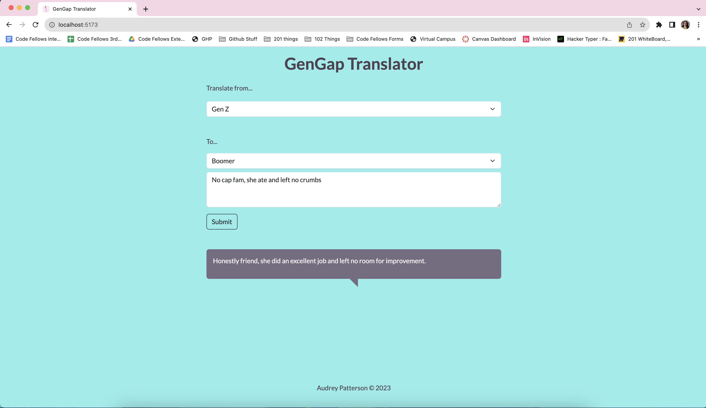
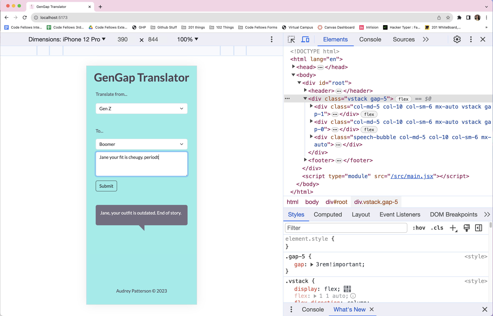

# Gen Z Translation App

This application is designed to bridge the generation gap by facilitating communication between Boomers and Gen Z individuals. It provides a simple and intuitive interface for translating slang, jargon, and cultural references between these two generations.

## Features

- Translate slang, jargon, and cultural references from Boomer to Gen Z, and vice versa.
- User-friendly interface for entering text and receiving translations.
- Real-time translation with minimal latency.
- Mobile-responsive design for use on various devices.

### Screenshots





### App in action

  <video autoplay loop muted plays-inline >
    <source src="src/assets/gengap.mp4" type="video/mp4"/>
  </video>

Press play

### Built With

[![React][React.js]][React-url]
[![Bootstrap][Bootstrap.com]][Bootstrap-url]

## Getting Started

Follow these instructions to set up and run the Gen Z Translation App on your local machine.

### Prerequisites

Make sure you have the following software installed on your system:

- Node.js
- npm (Node Package Manager)

### Installation

*This application is a full-stack application and you will also need the corresponding api located here: [gen-z-translate-api](https://github.com/arpatterson31/gen-z-translate-api)*

1. Clone the repo

   ```bash
   git clone https://github.com/arpatterson31/gen-z-front-end.git
   ```

2. Install NPM packages

   ```bash
   npm install
   ```

3. Run the server

   ```bash
   npm run dev
   ```

### Configuration

This project is dependent on the API as well: [gen-z-translate-api](https://github.com/arpatterson31/gen-z-translate-api). The API once installed is defaulted to run on port 3002. Make sure to create a `.env` file in the root of the project and the url to the server as follows:

```sh
   VITE_SERVER_URL=http://localhost:3002
```

## Acknowledgments

- [Img Shields](https://shields.io)

[React.js]: https://img.shields.io/badge/React-20232A?style=for-the-badge&logo=react&logoColor=61DAFB
[React-url]: https://reactjs.org/
[Bootstrap.com]: https://img.shields.io/badge/Bootstrap-563D7C?style=for-the-badge&logo=bootstrap&logoColor=white
[Bootstrap-url]: https://getbootstrap.com
